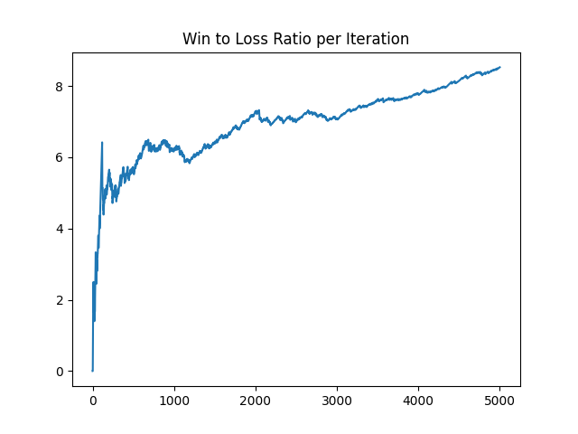

# tic-tac-toe-machine-learning
A full-circle machine learning system for tic tac toe.  

Task: to win tic tac toe  
Performance: win ratio  
Experience: learning model plays against a fixed-weight model  

## Dependencies
reprint
numpy
matplotlib

## Usage
Just run the script and wait for it to finish training.
Afterwards you will see a graph of the model's progress.

There are a few user params you can set before running the script:
- `win_rate_stop` will quit the training after the model achieves this win_rate
- use `game_num_stop` as a maximum number of games to train on
- set `slow_mode` to `True` if you want to watch the process more closely

## Sample Output
```
Model X params:  -5.04 165.16 -11.01 0.00 -61.34  LEARNER
Model O params:  0.00 0.00 0.00 0.00 0.00  FROZEN
- X -
- O X
  O -
LEARNER Wins: 2427.0
LEARNER Losses: 281.0
LEARNER Ties: 1607.0
Win Rate: 0.56
Win/Loss Rate: 8.61
Program status: PLAYING
```


## Game Representation
- the board is a 3x3 numpy matrix
- `0` denotes an empty space
- `1` marks x's moves
- `-1` marks o's moves

## Model, Loss, and Optimization
- the model is a linear approximation of a **value function** for board states
- four features are extracted from a given board state
	1. number of x's 2 in a row
	2. number of x's 3 in a row
	3. number of o's 2 in a row
	4. number of o's 3 in a row
- loss function (J) is squared error
- weights and biases are updated by performing gradient descent on J

## To Do
- allow human to play the trained AI
- better feature engineering, last weight never gets changed, also model's win_rate is too low
- implement weight regularization, model tends to converge to ridiculously large weights 
- reset frozen_model's weights on every new game
